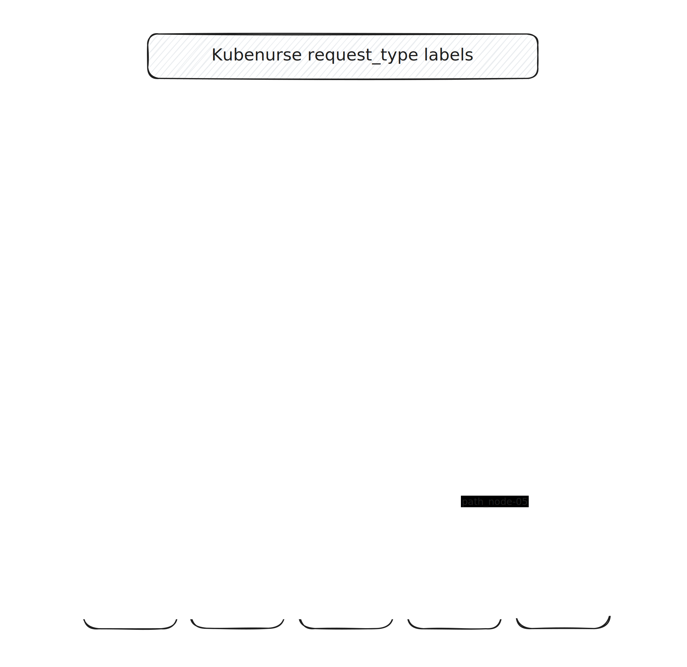
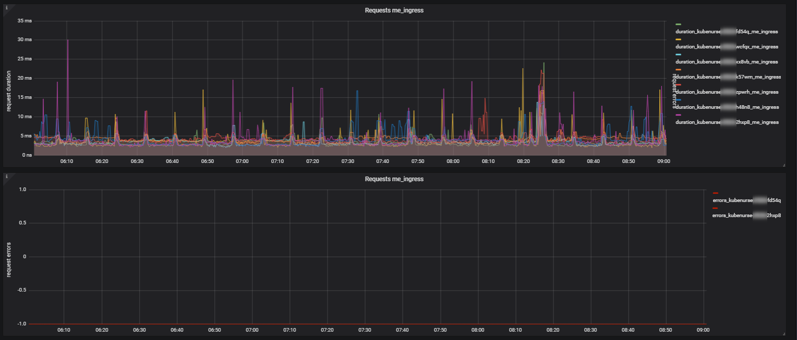
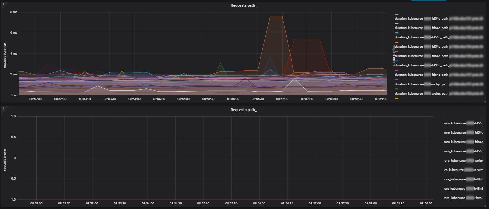
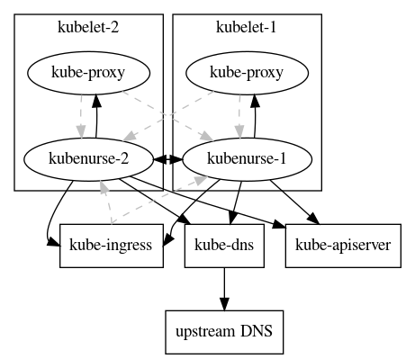
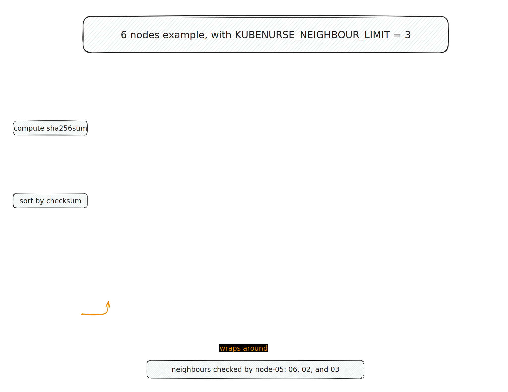

[](https://github.com/postfinance/kubenurse/actions/workflows/release.yml)
[](https://coveralls.io/github/postfinance/kubenurse?branch=master)


<!-- DocToc command: doctoc --notitle README.md --update-only --maxlevel 2 -->

<!-- START doctoc generated TOC please keep comment here to allow auto update -->
<!-- DON'T EDIT THIS SECTION, INSTEAD RE-RUN doctoc TO UPDATE -->

- [Kubenurse](#kubenurse)
  - [Deployment](#deployment)
    - [Helm deployment](#helm-deployment)
  - [Configuration](#configuration)
  - [http Endpoints](#http-endpoints)
  - [Health Checks](#health-checks)
    - [API Server Direct](#api-server-direct)
    - [API Server DNS](#api-server-dns)
    - [Me Ingress](#me-ingress)
    - [Me Service](#me-service)
    - [Neighbourhood](#neighbourhood)
  - [Metrics](#metrics)

<!-- END doctoc generated TOC please keep comment here to allow auto update -->

# Kubenurse

Kubenurse is a little service that monitors all network connections in a
Kubernetes cluster. Kubenurse measures request durations, records errors and
exports those metrics in Prometheus format.

Here's an overview of the checks performed by kubenurse, which are exposed as
labels for the various duration/error prometheus metrics.



## Deployment

You can get the Docker image from [Docker Hub](https://hub.docker.com/r/postfinance/kubenurse/).
The [examples](https://github.com/postfinance/kubenurse/tree/master/examples) directory
contains manifests which can be used to deploy kubenurse to the kube-system namespace of your cluster.

### Helm deployment

You can also deploy kubenurse with Helm, the Chart can be found in repository `https://postfinance.github.io/kubenurse/` or directory `./helm/kubenurse/`.
The following command can be used to install kubenurse with Helm: `helm upgrade [RELEASE_NAME] --install --repo https://postfinance.github.io/kubenurse/ kubenurse`.

#### Configuration settings

| Setting                            | Description                                                                                                          | Default                            |
|------------------------------------|----------------------------------------------------------------------------------------------------------------------|------------------------------------|
| daemonset.image.repository         | The repository name                                                                                                  | `postfinance/kubenurse`            |
| daemonset.image.tag                | The tag/ version of the image                                                                                        | `v1.4.0`                           |
| daemonset.podLabels                | Additional labels to be added to the pods of the daemonset                                                           | `[]`                               |
| daemonset.podAnnotations           | Additional annotations to be added to the pods of the daemonset                                                      | `[]`                               |
| daemonset.podSecurityContext       | The security context of the daemonset                                                                                | `{}`                               |
| daemonset.priorityClassName        | The priority class name for the daemonset pods                                                                       | `""`                               |
| daemonset.containerSecurityContext | The security context of the containers within the pods of the daemonset                                              | `{}`                               |
| daemonset.containerResources       | The container resources of the containers within the pods of the daemonset                                           | `{}`                               |
| daemonset.containerImagePullPolicy | The container image pull policy the pods of the daemonset                                                            | `IfNotPresent`                     |
| daemonset.tolerations              | The tolerations of the daemonset                                                                                     | See Default tolerations below      |
| daemonset.dnsConfig                | Specifies the DNS parameters of the pods in the daemonset                                                            | `{}`                               |
| daemonset.volumeMounts             | Additional volumeMounts to be added to the pods of the daemonset                                                     | `[]`                               |
| daemonset.volumes                  | Additional volumes to be added to the daemonset                                                                      | `[]`                               |
| serviceMonitor.enabled             | Adds a ServiceMonitor for use with [Prometheus-operator](https://github.com/prometheus-operator/prometheus-operator) | `false`                            |
| serviceMonitor.labels              | Additional labels to be added to the ServiceMonitor                                                                  | `{}`                               |
| serviceAccount.name                | The name of the service account which is used                                                                        | `Release.Name`                     |
| service.name                       | The name of service which exposes the kubenurse application                                                          | `8080-8080`                        |
| service.port                       | The port number of the service                                                                                       | `8080`                             |
| service.labels                     | Additional labels to be added to the Service                                                                         |                                    |
| ingress.enabled                    | Enable/ Disable the ingress                                                                                          | `true`                             |
| ingress.className                  | The classname of the ingress controller (e.g. the nginx ingress controller)                                          | `nginx`                            |
| ingress.url                        | The url of the ingress; e.g. kubenurse.westeurope.cloudapp.example.com                                               | `dummy-kubenurse.example.com`      |
| insecure                           | Set `KUBENURSE_INSECURE` environment variable                                                                        | `true`                             |
| allow_unschedulable                | Sets `KUBENURSE_ALLOW_UNSCHEDULABLE` environment variable                                                            | `false`                            |
| neighbour_filter                   | Sets `KUBENURSE_NEIGHBOUR_FILTER` environment variable                                                               | `app.kubernetes.io/name=kubenurse` |
| neighbour_limit                    | Sets `KUBENURSE_NEIGHBOUR_LIMIT` environment variable                                                                | `10`                               |
| histogram_buckets                  | Sets `KUBENURSE_HISTOGRAM_BUCKETS` environment variable                                                              |                                  |
| extra_ca                           | Sets `KUBENURSE_EXTRA_CA` environment variable                                                                       |                                    |
| check_api_server_direct            | Sets `KUBENURSE_CHECK_API_SERVER_DIRECT` environment variable                                                        | `true`                             |
| check_api_server_dns               | Sets `KUBENURSE_CHECK_API_SERVER_DNS` environment variable                                                           | `true`                             |
| check_me_ingress                   | Sets `KUBENURSE_CHECK_ME_INGRESS` environment variable                                                               | `true`                             |
| check_me_service                   | Sets `KUBENURSE_CHECK_ME_SERVICE` environment variable                                                               | `true`                             |
| check_neighbourhood                | Sets `KUBENURSE_CHECK_NEIGHBOURHOOD` environment variable                                                            | `true`                             |
| check_interval                     | Sets `KUBENURSE_CHECK_INTERVAL` environment variable                                                                 | `5s`                               |
| reuse_connections                  | Sets `KUBENURSE_REUSE_CONNECTIONS` environment variable                                                              | `false`                            |
| use_tls                            | Sets `KUBENURSE_USE_TLS` environment variable                                                                        | `false`                            |
| cert_file                          | Sets `KUBENURSE_CERT_FILE` environment variable                                                                      |                                    |
| cert_key                           | Sets `KUBENURSE_CERT_KEY` environment variable                                                                       |                                    |

Default tolerations:

```yaml
- effect: NoSchedule
  key: node-role.kubernetes.io/master
  operator: Equal
- effect: NoSchedule
  key: node-role.kubernetes.io/control-plane
  operator: Equal
```

After everything is set up and Prometheus scrapes the kubenurses, you can build
dashboards [as this example](./doc/grafana-kubenurse.json) that show network
latencies and errors or use the metrics for alarming.




## Configuration

kubenurse is configured with environment variables:

- `KUBENURSE_INGRESS_URL`: An URL to the kubenurse in order to check the ingress
- `KUBENURSE_SERVICE_URL`: An URL to the kubenurse in order to check the Kubernetes service
- `KUBENURSE_INSECURE`: If "true", TLS connections will not validate the certificate
- `KUBENURSE_EXTRA_CA`: Additional CA cert path for TLS connections
- `KUBENURSE_NAMESPACE`: Namespace in which to look for the neighbour kubenurses
- `KUBENURSE_NEIGHBOUR_FILTER`: A Kubernetes label selector (eg. `app=kubenurse`) to filter neighbour kubenurses
- `KUBENURSE_NEIGHBOUR_LIMIT`: The maximum number of neighbours each kubenurse will query
- `KUBENURSE_ALLOW_UNSCHEDULABLE`: If this is `"true"`, path checks to neighbouring kubenurses are made even if they are running on unschedulable nodes.
- `KUBENURSE_CHECK_API_SERVER_DIRECT`: If this is `"true"` kubenurse will perform the check [API Server Direct](#API Server Direct). default is "true"
- `KUBENURSE_CHECK_API_SERVER_DNS`: If this is `"true"`, kubenurse will perform the check [API Server DNS](#API Server DNS). default is "true"
- `KUBENURSE_CHECK_ME_INGRESS`: If this is `"true"`, kubenurse will perform the check [Me Ingress](#Me Ingress). default is "true"
- `KUBENURSE_CHECK_ME_SERVICE`: If this is `"true"`, kubenurse will perform the check [Me Service](#Me Service). default is "true"
- `KUBENURSE_CHECK_NEIGHBOURHOOD`: If this is `"true"`, kubenurse will perform the check [Neighbourhood](#neighbourhood). default is "true"
- `KUBENURSE_CHECK_INTERVAL`: the frequency to perform kubenurse checks. the string should be formatted for [time.ParseDuration](https://pkg.go.dev/time#ParseDuration). defaults to `5s`
- `KUBENURSE_REUSE_CONNECTIONS`: whether to reuse connections or not for all checks. default is "false"
- `KUBENURSE_HISTOGRAM_BUCKETS`: optional comma-separated list of float64, used in place of the [default prometheus histogram buckets](https://pkg.go.dev/github.com/prometheus/client_golang@v1.16.0/prometheus#DefBuckets)
- `KUBENURSE_USE_TLS`: If this is `"true"`, enable TLS endpoint on port 8443
- `KUBENURSE_CERT_FILE`: Certificate to use with TLS endpoint
- `KUBENURSE_CERT_KEY`: Key to use with TLS endpoint

Following variables are injected to the Pod by Kubernetes and should not be defined manually:

- `KUBERNETES_SERVICE_HOST`: Host to communicate to the kube-apiserver
- `KUBERNETES_SERVICE_PORT`: Port to communicate to the kube-apiserver

The used http client appends the certificate `/var/run/secrets/kubernetes.io/serviceaccount/ca.crt` if found.

## http Endpoints

The kubenurse service listens for http requests on port 8080 (optionally https on port 8443) and exposes endpoints:

- `/`: Redirects to `/alive`
- `/alive`: Returns a pretty printed JSON with the check results, described below
- `/alwayshappy`: Returns http-200 which is used for testing itself
- `/metrics`: Exposes [Prometheus](https://prometheus.io/) metrics

The `/alive` endpoint returns a JSON like this with status code 200 if everything is OK else 500:

```json
{
  "api_server_direct": "ok",
  "api_server_dns": "ok",
  "me_ingress": "ok",
  "me_service": "ok",
  "hostname": "kubenurse-1234-x2bwx",
  "neighbourhood_state": "ok",
  "neighbourhood": [
   {
    "PodName": "kubenurse-1234-8fh2x",
    "PodIP": "10.10.10.67",
    "HostIP": "10.12.12.66",
    "NodeName": "k8s-66.example.com",
    "Phase": "Running"
   },
   {
    "PodName": "kubenurse-1234-ffjbs",
    "PodIP": "10.10.10.138",
    "HostIP": "10.12.12.89",
    "NodeName": "k8s-89.example.com",
    "Phase": "Running"
   }
  ],
  "headers": {
   "Accept": [
    "text/html,application/xhtml+xml,application/xml;q=0.9,image/webp,image/apng,*/*;q=0.8"
   ],
   "Accept-Encoding": [
    "gzip, deflate, br"
   ],
   ...
  }
}
```

## Health Checks

Every five seconds, the checks described below are run.

A little illustration of what communication occurs, is here:



### API Server Direct

Checks the `/version` endpoint of the Kubernetes API Server through
the direct link (`KUBERNETES_SERVICE_HOST`, `KUBERNETES_SERVICE_PORT`).

Metric type: `api_server_direct`

### API Server DNS

Checks the `/version` endpoint of the Kubernetes API Server through
the Cluster DNS URL `https://kubernetes.default.svc:$KUBERNETES_SERVICE_PORT`.
This also verifies a working `kube-dns` deployment.

Metric type: `api_server_dns`

### Me Ingress

Checks if the kubenurse is reachable at the `/alwayshappy` endpoint behind the ingress.
This address is provided by the environment variable `KUBENURSE_INGRESS_URL` that
could look like `https://kubenurse.example.com`.
This also verifies a correct upstream DNS resolution.

Metric type: `me_ingress`

### Me Service

Checks if the kubenurse is reachable at the `/alwayshappy` endpoint through the Kubernetes service.
The address is provided by the environment variable `KUBENURSE_SERVICE_URL` that
could look like `http://kubenurse.mynamespace.default.svc:8080`.
This also verifies a working `kube-proxy` setup.

Metric type: `me_service`

### Neighbourhood

Checks if every neighbour kubenurse is reachable at the `/alwayshappy` endpoint.
Neighbours are discovered by querying the kube-apiserver for every Pod in the
`KUBENURSE_NAMESPACE` with label `KUBENURSE_NEIGHBOUR_FILTER`.
The request is done directly to the Pod-IP (port 8080, or 8443 if TLS is enabled) and the metric types contains the prefix
`path_` and the hostname of the kubelet on which the neighbour kubenurse should run.
Only kubenurses on nodes that are schedulable are considered as neighbours,
this can be changed by setting `KUBENURSE_ALLOW_UNSCHEDULABLE="true"`.

Metric type: `path_$KUBELET_HOSTNAME`

#### Neighbourhood filtering

The number of checks for the neighbourhood used to grow as $O(N^2)$, which
rendered `kubenurse` impractical on large clusters, as documented in issue
[#55](https://github.com/postfinance/kubenurse/issues/55).
To combat this, a node filtering feature was implemented, which works as follows

- kubenurse computes the `sha256` checksums for all neighbours' node names
- it sorts those checksums (this is actually implemented with a max-heap)
- it computes its own node name checksum, and queries the next 10 (per default)
  nodes in the sorted checksums list

Here's an example with 6 nodes, where each node queries the next 3 nodes:



Thanks to this, every node is making queries to the same 10 nodes, unless one
of those nodes disappears, in which case kubenurse will pick the next node in
the sorted checksums list. This comes with several advantages:

- because of the way we first hash the node names, the checks distribution is
  randomly distributed, independant of the node names. if we only picked the 10
  next nodes in a sorted list of the node names, then we might have biased the
  results in environments where node names are sequential
- metrics-wise, a `kubenurse` pod should typically only have entries for ca. 10
  other neighbouring nodes worth of checks, which greatly reduces the load on
  your monitoring infrastructure
- because we use a deterministic algorithm to choose which nodes to query, the
  metrics churn rate stays minimal. (that is, if we randomly picked 10 nodes
  for every check, then in the end there would be one prometheus bucket for
  every node on the cluster, which would put useless load on the monitoring
  infrastructure)

Per default, the neighbourhood filtering is set to 10 nodes, which means that
on cluster with more than 10 nodes, each kubenurse will query 10 nodes, as
described above.

##### Neighbourhood incoming checks metric

It is possible to check that each node receives the proper number of
neighbourhood queries with the `kubenurse_neighbourhood_incoming_checks`
metric. If you have the neighbourhood limit set to e.g. 10, then this
metric should be equal to 10 on all nodes, with some variations during a
rollout restart.

To bypass the node filtering feature, you simply need to set the
`KUBENURSE_NEIGHBOUR_LIMIT` environment variable to 0.

## Metrics

All performed checks expose metrics which can be used to monitor/alert:

- node-to-node network latencies and errors
- pod-to-apiserver communication
- Ingress roundtrip latencies and errors
- Service roundtrip latencies and errors (kube-proxy / your CNI)
- Major kube-apiserver issues
- kube-dns (or CoreDNS) errors
- External DNS resolution errors (ingress URL resolution)

At `/metrics` you will find the following metrics:

- `kubenurse_errors_total`: Kubenurse error counter partitioned by error type
- `kubenurse_request_duration`: a histogram for Kubenurse request duration partitioned by error type
- `kubenurse_httpclient_request_duration_seconds`:  a latency histogram of request latencies from the kubenurse http client.
- `kubenurse_httpclient_trace_requests_total`: a latency histogram for the http
  client _trace_ metric instrumentation, with detailed statistics for e.g.
  `dns_start`, `got_conn` events, and more. the details can be seen in the
  [`httptrace.go`](https://github.com/postfinance/kubenurse/blob/52767fbb280b65c06ac926dac49dd874e9ec4aee/internal/servicecheck/httptrace.go#L73)
  file
- `kubenurse_neighbourhood_incoming_checks`: a gauge which reports how many
  unique neighbours have queried the current pod in the last minute
